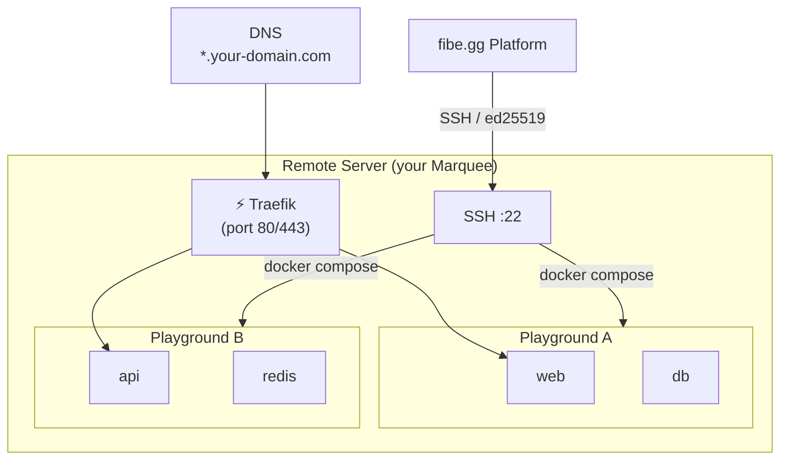

# Marquee

A **Marquee** is a remote Docker host that serves as the infrastructure layer for your environments. Every [Playground](/core-concepts/playground) runs on exactly one Marquee.## Infrastructure Gateway (SSH Terminal)

Every Marquee includes a built-in interactive SSH Terminal. This is your direct connection to the host machine—a beacon in the dark that allows you to touch the metal of your fleet.

- **Interactive Shell**: Execute commands in real-time.
- **Secure Access**: Tunnel through encrypted sessions managed by Fibe.
- **Diagnostics**: Rapidly investigate host status without external tools.

## Overview

When you create a Marquee, you provide SSH credentials to a remote server that has Docker installed. fibe.gg connects to this server over SSH and uses Docker Compose to orchestrate your services. [Traefik](https://traefik.io/) runs on every Marquee as a reverse proxy, handling routing, HTTPS certificates, and authentication.

:::info One Marquee at a Time
Each Marquee represents a single managed host. A Marquee can run multiple Playgrounds simultaneously, but each Playground lives on exactly one Marquee.
:::

## Configuration

| Field | Description |
|-------|-------------|
| **Name** | A human-readable label for this Marquee |
| **Host** | SSH hostname or IP address of the remote server |
| **Port** | SSH port (default: `22`) |
| **User** | SSH username used for connection |
| **Domains** | One or more domains routed to this Marquee (the first domain is the root domain) |
| **ACME Email** | Email address used for Let's Encrypt TLS certificate provisioning |
| **Use Sudo** | Whether Docker commands should be prefixed with `sudo` |
| **Status** | `active`, `disabled`, or `error` |

## SSH Connection

fibe.gg communicates with your server exclusively over SSH using **ed25519** key pairs.

### Key Generation

When you create a Marquee, you can generate an SSH key pair directly from the UI or the API. The system generates an `ed25519` key pair, stores the private key (encrypted at rest), and provides you with the public key.

Add this public key to the `~/.ssh/authorized_keys` file on your remote server for the configured user.

### Connection Test

After configuring your Marquee, use the **Test Connection** button to verify:

1. **SSH connectivity** — Can the platform reach your server?
2. **Docker availability** — Is Docker installed and accessible to the configured user?
3. **Directory access** — Can the platform write to `/opt/fibe`?

## TLS / HTTPS

Every Marquee uses [Let's Encrypt](https://letsencrypt.org/) to automatically provision TLS certificates for all configured domains. The **ACME Email** field is required and is used for certificate registration and renewal notifications.

All services running on a Marquee are accessible exclusively over HTTPS. HTTP requests are automatically redirected to HTTPS.

## Traefik

[Traefik](https://traefik.io/) runs on every Marquee as the ingress controller. It:

- Routes traffic to the correct Playground service based on subdomain
- Handles automatic TLS certificate provisioning and renewal
- Enforces HTTP Basic Auth for [internal services](/services/networking)
- Provides an internal dashboard (protected by the Marquee's internal password)

You do not need to install or configure Traefik manually — it is managed entirely by the platform.

## Domains

A Marquee can have one or more domains. The **first domain** in the list is the **root domain** used to generate subdomains for your services.

For example, if your root domain is `dev.example.com`, a service with subdomain `web` would be accessible at `https://web.dev.example.com`.

:::tip Free Domain
If your Marquee was provisioned through a subscription plan, it may include a free `*.fibe.gg` subdomain automatically.
:::

## Host Requirements

Before creating a Marquee, your remote server must meet these requirements:

| Requirement | Details |
|-------------|---------|
| **SSH access** | The platform must be able to reach the host over SSH |
| **Docker** | Docker Engine must be installed and accessible to the configured user |
| **User permissions** | The user must have permission to run `docker` commands (or `sudo` must be enabled) |
| **Docker group** | The user should be a member of the `docker` group for genie container Docker socket access |
| **Directory access** | The user must have read/write access to `/opt/fibe` |
| **Inbound ports** | Ports `80` and `443` must be open for HTTP/HTTPS traffic |
| **DNS** | Your domain(s) must have A/CNAME records pointing to the server's IP address |

## Resource Limits

Marquee creation is **subscription-based**. Each subscription plan includes a Marquee allowance — for example, a Single plan grants 1 Marquee, while a Multiplayer plan grants up to 10. Multiple subscriptions stack their allowances.
