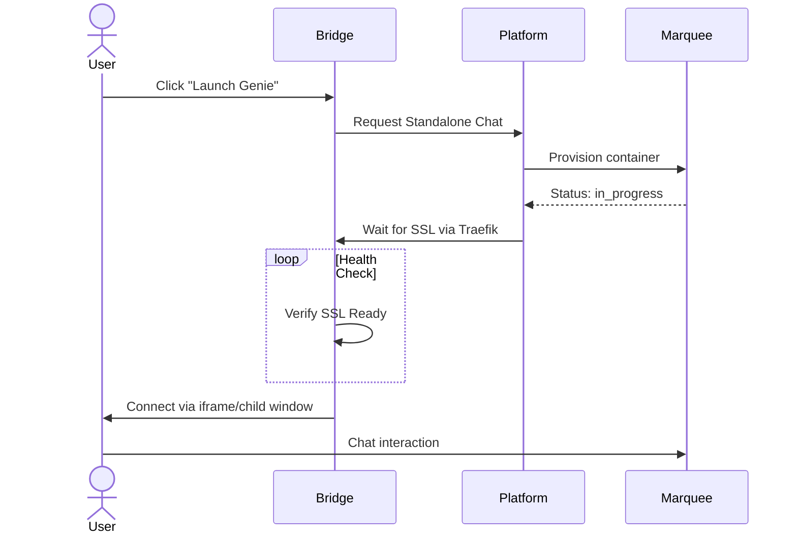

# Bridge

The **Bridge** is the central management hub for all your AI genies. It provides a unified, full-screen interface where you can quickly switch between active genie chats, monitor their status, and manage their lifecycle across all your [Marquees](/core-concepts/marquee).

## Key Features

### 1. Unified Genie Sidebar
The left sidebar lists all your registered genies. You can see their current status at a glance:
- **Authenticated:** Ready for chat or attachment to Playgrounds.
- **Pending:** Requires credential setup.
- **Active Chat:** Indicates a genie currently running a standalone chat session.

### 2. Instant Tab Switching
The Bridge uses a high-performance client-side switching mechanism. When you click on a genie, the interface updates instantly without a full page reload or iframe flicker, allowing you to jump between different AI assistants seamlessly.

### 3. Real-time Status & Reachability
The Bridge continuously monitors the health of your genie containers.
- **SSL Verification:** If a chat is deploying, the Bridge checks if the SSL certificate is ready before letting you in.
- **Automatic Retries:** If a connection is temporarily lost, the Bridge attempts to reconnect and updates the UI status in real-time.

### 4. Direct Terminal & Logs
Access advanced developer tools directly from the Bridge:
- **View Logs:** Stream live container logs to debug genie behavior or provider connection issues.
- **Debug Terminal:** Open a web-based shell into the genie sidecar for deep inspection.

### 5. Playground Selector (Project Switcher)

Each genie chat includes a **Playground Selector** in the header — a file browser that lets you switch which project directory the genie is working in, without restarting the session.

- **Browse** the `PLAYROOMS_ROOT` directory tree to find your project folder
- **Link** any directory to become the active workspace (highlighted in green once linked)
- **Smart Mount** (✨) — automatically links the first available directory if none is selected
- **Breadcrumb navigation** — Back/Home buttons for navigating nested directories
- On mobile the selector shows only the folder icon; the label appears on larger screens

This is especially useful when you have multiple projects on the same host and want to switch context without redeploying the genie.

## Standalone Chat Lifecycle

Through the Bridge, you can launch genies on any active Marquee without creating a full Playground.

1. **Launch:** Pick a genie and a destination Marquee.
2. **Interact:** Chat with the genie via its own unique subdomain.
3. **Extend:** Standalone chats have a default TTL (typically 2 hours). You can extend this or set it to **Never Expire**.
4. **Purge:** Use the "Purge" action to completely wipe the genie's remote environment and start fresh.

## Mobile Chat Interface

The genie chat interface is fully optimised for mobile devices:

- **Adaptive header** — On small screens, the Playground Selector collapses to an icon-only button; the terminal toggle moves into the search row to save vertical space.
- **iOS keyboard handling** — The layout stays pinned when the virtual keyboard opens so the input is always visible.
- **No scroll jitter** — Virtual list height estimation uses per-message pre-computed measurements, eliminating layout shifts during streaming.

## External Link Behaviour

When a genie includes links in its responses:

- **Embedded (iframe) mode** — Links open in the **parent window** (`_parent`), so the user navigates within your app rather than inside the tiny iframe.
- **Standalone mode** — Links open in a **new tab** (`_blank`).

Only links inside chat message content (`.prose`) are affected — UI links behave normally.

## Inbox & Notifications

The Bridge includes an **Inbox** accessible via the floating action button (FAB) at the bottom of the screen. The FAB has two tabs — **Agents** and **Inbox**:

### Agents Tab
Lists all your registered genies with quick-access links and active chat status.

### Inbox Tab
A real-time notification center with two sections:

- **Now**: Recent activity notifications that auto-dismiss after 30 seconds (errors persist for 60 seconds), shown with animated progress bars
- **Earlier**: Persistent notifications showing past activity with actor icons, action labels, resource links, and timestamps
- **Unread Badge**: A visual indicator on the FAB showing new notification count

### Mini-Toast Notifications
Quick crumb notifications appear at the top-center of the page for important events. They auto-dismiss after 4 seconds (errors stay indefinitely).

### Webpush (Browser Push)
You can optionally subscribe to **browser push notifications** to receive alerts even when the fibe.gg tab is in the background:

- Click the "Subscribe" banner when prompted
- Notifications appear as system-level alerts
- Respects your notification preferences — opt out of specific event types
- On iOS, requires the PWA to be installed to the home screen

## Genie Mutters (Internal Reasoning)

Modern AI genies often perform complex reasoning before producing a response. The Bridge exposes these "Mutters" (internal thoughts) in a dedicated panel, giving you transparency into the genie's decision-making process.

- **Traceable logic:** See exactly how the genie is approaching your task.
- **Debugging:** Identify where a genie might be getting stuck or misinterpreting instructions.
