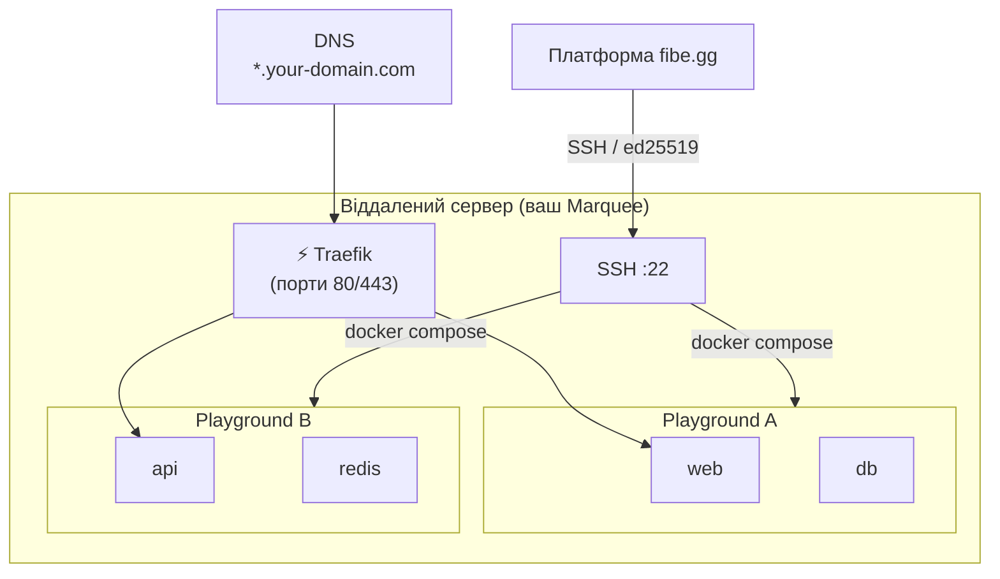

# Marquee

**Marquee** — це віддалений Docker-хост, що слугує інфраструктурним шаром для ваших середовищ. Кожен [Playground](/core-concepts/playground) працює саме на одному Marquee.

## Огляд

Коли ви створюєте Marquee, ви надаєте SSH-дані для підключення до віддаленого сервера з встановленим Docker. fibe.gg підключається до цього сервера по SSH і використовує Docker Compose для оркестрації ваших сервісів. [Traefik](https://traefik.io/) працює на кожному Marquee як реверс-проксі, забезпечуючи маршрутизацію, HTTPS-сертифікати та автентифікацію.

:::info Один Marquee за раз
Кожен Marquee представляє один керований хост. Marquee може запускати кілька Playground одночасно, але кожен Playground працює лише на одному Marquee.
:::

## Конфігурація

| Поле | Опис |
|------|------|
| **Назва** | Зрозуміла назва для цього Marquee |
| **Хост** | SSH-імʼя хоста або IP-адреса віддаленого сервера |
| **Порт** | SSH-порт (за замовчуванням: `22`) |
| **Користувач** | SSH-імʼя користувача для підключення |
| **Домени** | Один або кілька доменів, спрямованих на цей Marquee (перший домен є кореневим) |
| **ACME Email** | Електронна пошта для видачі TLS-сертифікатів Let's Encrypt |
| **Використовувати Sudo** | Чи потрібно додавати `sudo` перед командами Docker |
| **Статус** | `active`, `disabled` або `error` |

## SSH-зʼєднання

fibe.gg спілкується з вашим сервером виключно через SSH з використанням пар ключів **ed25519**.

### Генерація ключів

Коли ви створюєте Marquee, ви можете згенерувати пару SSH-ключів прямо з UI або через API. Система генерує пару ключів `ed25519`, зберігає приватний ключ (зашифрований при зберіганні) та надає вам публічний ключ.

Додайте цей публічний ключ до файлу `~/.ssh/authorized_keys` на вашому віддаленому сервері для налаштованого користувача.

### Тест зʼєднання

Після налаштування Marquee використайте кнопку **Test Connection** для перевірки:

1. **SSH-зʼєднання** — Чи може платформа досягти вашого сервера?
2. **Docker** — Чи встановлено Docker та чи доступний він для налаштованого користувача?
3. **Доступ до директорій** — Чи може платформа записувати в `/opt/fibe`?

## TLS / HTTPS

Кожен Marquee використовує [Let's Encrypt](https://letsencrypt.org/) для автоматичної видачі TLS-сертифікатів для всіх налаштованих доменів. Поле **ACME Email** є обовʼязковим і використовується для реєстрації сертифікатів та повідомлень про оновлення.

Всі сервіси, що працюють на Marquee, доступні виключно через HTTPS. HTTP-запити автоматично перенаправляються на HTTPS.

## Traefik

[Traefik](https://traefik.io/) працює на кожному Marquee як ingress-контролер. Він:

- Маршрутизує трафік до правильного сервісу Playground за субдоменом
- Забезпечує автоматичну видачу та оновлення TLS-сертифікатів
- Забезпечує HTTP Basic Auth для [внутрішніх сервісів](/services/networking)
- Надає внутрішній дашборд (захищений внутрішнім паролем Marquee)

Вам не потрібно встановлювати або налаштовувати Traefik вручну — він повністю керується платформою.

## Домени

Marquee може мати один або кілька доменів. **Перший домен** у списку є **кореневим доменом**, що використовується для генерації субдоменів ваших сервісів.

Наприклад, якщо ваш кореневий домен — `dev.example.com`, сервіс із субдоменом `web` буде доступний за адресою `https://web.dev.example.com`.

:::tip Безкоштовний домен
Якщо ваш Marquee був створений через план підписки, він може автоматично включати безкоштовний субдомен `*.fibe.gg`.
:::

## Вимоги до хоста

Перед створенням Marquee ваш віддалений сервер повинен відповідати таким вимогам:

| Вимога | Деталі |
|--------|--------|
| **SSH-доступ** | Платформа повинна мати змогу досягти хоста по SSH |
| **Docker** | Docker Engine повинен бути встановлений та доступний для налаштованого користувача |
| **Права користувача** | Користувач повинен мати дозвіл на виконання команд `docker` (або `sudo` повинен бути увімкнений) |
| **Доступ до директорій** | Користувач повинен мати доступ на читання/запис до `/opt/fibe` |
| **Вхідні порти** | Порти `80` та `443` повинні бути відкриті для HTTP/HTTPS трафіку |
| **DNS** | Ваші домени повинні мати A/CNAME записи, що вказують на IP-адресу сервера |

## Ліміти ресурсів

Створення Marquee базується на **підписці**. Кожен план підписки включає ліміт Marquee — наприклад, план Single надає 1 Marquee, а план Multiplayer — до 10. Кілька підписок складають свої ліміти.
