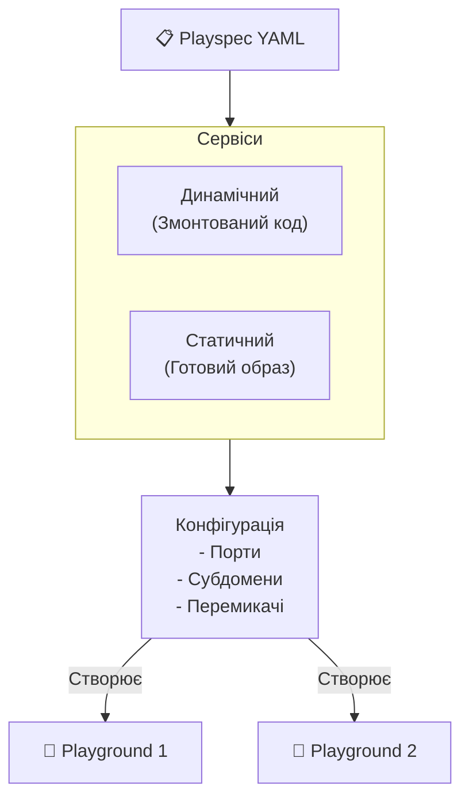

# Playspec

**Playspec** — це блюпринт, що визначає структуру вашого середовища розробки. Він обгортає Docker Compose файл, класифікує кожен сервіс та збагачує його конфігурацією платформи — маршрутизацією та монтуванням вихідного коду.

## Огляд

Уявіть Playspec як **шаблон середовища, що можна використовувати повторно**. Ви визначаєте його один раз, а потім запускаєте скільки завгодно [Playground](/core-concepts/playground) з нього — кожен Playground є незалежним, запущеним екземпляром того самого Playspec.

## Конфігурація

| Поле | Опис |
|------|------|
| **Назва** | Зрозуміла назва для цього Playspec |
| **Опис** | Необовʼязковий опис (до 1000 символів) |
| **Docker Compose YAML** | Базовий `docker-compose.yml`, що визначає ваші сервіси |
| **Сервіси** | Класифікований список сервісів (див. нижче) |
| **Persist Volumes** | Чи зберігати Docker-томи при пересозданні Playground |

## Docker Compose визначення

Кожен Playspec починається зі стандартного Docker Compose YAML. Ви можете:

- **Написати вручну** у вбудованому YAML-редакторі
- **Завантажити з Prop** — Якщо ваш репозиторій містить `docker-compose.yml`, платформа автоматично його виявить та імпортує
- **Імпортувати з шаблону** — Використайте готовий шаблон з [Stargate](/launch/stargate) або [My Fleet](/launch/my-fleet)

Платформа парсить та валідує Compose-файл, витягуючи визначення сервісів, порти та іншу конфігурацію.

## Класифікація сервісів

Після надання Compose YAML ви маєте класифікувати кожен сервіс як **статичний** або **динамічний**:

| Тип | Опис | Приклад |
|-----|------|---------|
| **Статичний** | Стандартний Docker-контейнер з готовим образом. Без монтування вихідного коду. | PostgreSQL, Redis, Elasticsearch |
| **Динамічний** | Сервіс з вихідним кодом. Підтримує Dev-режим (живе редагування) та Production-режим (зібраний образ). | Ваш веб-додаток, API-сервер, worker |

### Конфігурація динамічного сервісу

Кожен динамічний сервіс вимагає додаткової конфігурації:

| Поле | Опис | За замовчуванням |
|------|------|-----------------|
| **Prop** | Який GitHub-репозиторій надає вихідний код | — |
| **Шлях до Dockerfile** | Шлях до Dockerfile у репозиторії | `Dockerfile` |
| **Шлях до Env File** | Шлях до `.env.example` для змінних середовища за замовчуванням | `.env.example` |
| **Робоча директорія** | Робоча директорія контейнера, куди монтується вихідний код | `/app` |

### Конфігурація статичного сервісу

Статичні сервіси вимагають лише імʼя **образу** (напр., `postgres:16`, `redis:7`).

## Відкриття сервісів

Кожен сервіс може бути відкритий для мережі з такими налаштуваннями:

| Поле | Опис | За замовчуванням |
|------|------|-----------------|
| **Увімкнено** | Чи доступний сервіс через HTTP | `false` |
| **Порт** | Порт контейнера для відкриття | `80` |
| **Субдомен** | Префікс субдомену для URL сервісу | Імʼя сервісу |
| **Видимість** | Рівень контролю доступу | `internal` |

### Параметри видимості

| Видимість | Поведінка |
|-----------|----------|
| **External** | Публічно доступний — будь-хто з URL може отримати доступ до сервісу |
| **Internal** | Захищений HTTP Basic Auth — вимагає імʼя користувача та пароль Playground |

:::tip Іменування субдоменів
Субдомени визначаються на рівні Playspec як значення за замовчуванням, але можуть бути **перевизначені для кожного Playground**. Це дозволяє кільком Playground з одного Playspec співіснувати на одному Marquee без конфліктів субдоменів.
:::

## Монтовані файли

Ви можете прикріпити до **50 файлів** (максимум **500 МБ кожен**) до Playspec. Ці файли синхронізуються на віддалений хост та монтуються у вказані сервіси. Типові випадки використання:

- Конфігураційні файли (напр., `nginx.conf`, `.env.production`)
- SSL-сертифікати
- Файли з початковими даними

Кожен монтований файл налаштовується з:
- **Шлях монтування** — Абсолютний шлях всередині контейнера
- **Цільові сервіси** — Які сервіси отримують монтування
- **Тільки для читання** — Чи є монтування тільки для читання (за замовчуванням: так)

## Облікові дані реєстру

Якщо ваші сервіси використовують образи з приватних Docker-реєстрів, ви можете додати облікові дані до Playspec. Платформа використовує ці дані для автентифікації операцій `docker pull` на Marquee.

## Augmented Compose Template

При збереженні Playspec платформа генерує **augmented compose template** — збагачену версію вашого оригінального Compose YAML, що включає:

- Мітки маршрутизації Traefik для кожного відкритого сервісу
- Мережеву конфігурацію для ізоляції сервісів та ingress
- Монтування томів для вихідного коду
- Змінні середовища платформи

Цей шаблон використовується внутрішньо і не може бути редагований безпосередньо. Він перегенеровується при зміні сервісів Playspec.

## Розгортання без простоїв (Zero-Downtime)

Сервіси можуть використовувати **розгортання без простоїв**, додавши мітку `playgrounds.zerodowntime: true`. Якщо цю функцію увімкнено, платформа використовує стратегію rolling update під час пересоздання Playground — старий контейнер продовжує обробляти трафік, поки новий запускається та проходить перевірку працездатності (healthcheck).

### Вимоги

| Вимога | Причина |
|--------|---------|
| `playgrounds.expose` має бути встановлено | Маршрутизація через Traefik є необхідною для перемикання трафіку |
| `healthcheck:` має бути визначено | Платформі необхідно переконатися, що новий контейнер готовий |
| Без маппінгу `ports:` | Маппінг портів хоста заважає співіснуванню кількох контейнерів |
| Без `container_name:` | Іменовані контейнери заважають масштабуванню |

### Як це працює

1. Нові образи збираються у звичайному режимі
2. Новий контейнер запускається паралельно зі старим
3. Після успішного `healthcheck`, Traefik перенаправляє трафік на новий контейнер
4. Старий контейнер плавно завершує роботу та видаляється

:::tip
Zero-downtime застосовується лише під час **роллаутів (rollouts)**. Перше створення Playground завжди використовує стандартний процес запуску.
:::

## Живі Playground та Редагування {#live-playgrounds--editing}

Ви можете **редагувати Playspec у будь-який момент**, навіть якщо з нього активно працюють Playground. Зміни набудуть чинності під час наступного **Rollout** або **Жорсткого перезапуску** — вам не потрібно видаляти та пересоздавати Playground.

Фоновий процес [Playguard](/core-concepts/playground#playguard) перевіряє стан кожні ~60 секунд і автоматично застосовує зміни Playspec до Playground, що мають дрейф конфігурації, тому зміни можуть поширюватися без будь-якого ручного втручання.

:::tip
Лише **назва, опис, сервіси та Compose YAML** Playspec мають значення для живих Playground. Монтовані файли та облікові дані реєстру також одразу стають доступними після наступного Rollout-у.
:::

### Stateful Playspecs (Persist Volumes)

Якщо **Persist Volumes** увімкнено, будьте особливо обережні під час редагування:

| Дія | Ризик |
|-----|-------|
| Перейменування сервісу | Залишає сиротами існуючі дані тому сервісу |
| Перейменування ключа тому у Compose YAML | Відключає живі дані (Docker розпізнає томи за назвою) |
| Вимкнення "Persist Volumes" | Негайно видаляє всі збережені томи |
| Додавання нового сервісу/тому | Безпечно — створює новий порожній том |

Сторінка редагування покаже модальне вікно з попередженням при спробі відредагувати stateful Playspec з живими Playground.

### Видалення

Playspec **не може бути видалений**, поки на нього посилається будь-який Playground. Спочатку видаліть усі пов'язані Playground, а потім видаліть Playspec.

## Збереження стану

Коли **Persist Volumes** увімкнено, Playspec вважається **stateful**. Це означає:

- Docker-томи зберігаються при пересозданні Playground
- Імена томів мають префікс `pv-{playspec_id}-{marquee_id}` для ізоляції
- Лише один Playground на комбінацію Playspec+Marquee може існувати одночасно (для запобігання конфліктів томів)

Коли вимкнено, томи знищуються та створюються заново при кожному пересозданні Playground.

## Ліміти ресурсів

| Ліміт | Значення |
|-------|---------|
| Максимум Playspec на акаунт | **1 000** |
| Максимум монтованих файлів на Playspec | **50** |
| Максимальний розмір файлу | **500 МБ** на файл |
