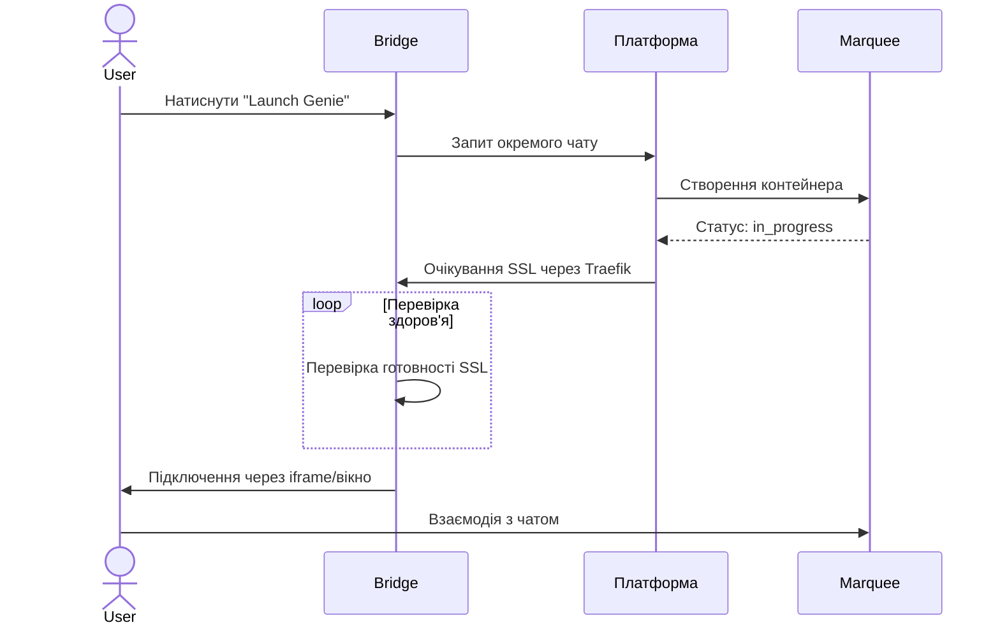

# Bridge

**Bridge** — це центральний хаб керування всіма вашими AI Геніями. Він надає єдиний повноекранний інтерфейс, де ви можете швидко перемикатися між активними чатами з Геніями, відстежувати їхній стан та керувати їхнім життєвим циклом у всіх ваших [Marquee](/core-concepts/marquee).

## Основні можливості

### 1. Єдина бічна панель Генії
Ліва бічна панель містить перелік усіх ваших зареєстрованих Генії. Ви можете бачити їхній поточний стан одразу:
- **Автентифікований:** Готовий до чату або приєднання до Playground.
- **Очікування:** Потребує налаштування облікових даних.
- **Активний чат:** Вказує, що Геній наразі виконує автономну чат-сесію.

### 2. Миттєве перемикання вкладок
Bridge використовує високопродуктивний клієнтський механізм перемикання. Коли ви натискаєте на Генія, інтерфейс оновлюється миттєво без повного перезавантаження сторінки або мерехтіння iframe, що дозволяє безперешкодно переходити між різними AI-асистентами.

### 3. Стан та доступність у реальному часі
Bridge безперервно відстежує стан ваших контейнерів Генії.
- **Перевірка SSL:** Якщо чат розгортається, Bridge перевіряє готовність SSL-сертифіката перед тим, як надати вам доступ.
- **Автоматичні повторні спроби:** Якщо з'єднання тимчасово втрачено, Bridge намагається повторно підключитися та оновлює стан інтерфейсу в реальному часі.

### 4. Прямий термінал та логи
Отримайте доступ до розширених інструментів розробника безпосередньо з Bridge:
- **Перегляд логів:** Потокова трансляція логів контейнера в реальному часі для налагодження поведінки Генія або проблем із підключенням до провайдера.
- **Термінал налагодження:** Відкрийте веб-оболонку в sidecar-контейнері Генія для глибокої інспекції.

### 5. Вибір Playground (Перемикач проєктів)

Кожний чат з Генієм містить **Вибір Playground** у заголовку — файловий браузер, що дозволяє перемикатися між директоріями проєктів без перезапуску сесії.

- **Перегляд** дерева директорій `PLAYROOMS_ROOT` для пошуку потрібної папки проєкту
- **Прив'язка** будь-якої директорії як активного робочого простору (підсвічується зеленим)
- **Smart Mount** (✨) — автоматично прив'язує першу доступну директорію
- **Навігація хлібними крихтами** — кнопки «Назад» та «Додому» для навігації вкладеними директоріями
- На мобільних пристроях відображається лише іконка; підпис з'являється на більших екранах

Особливо корисно, коли на одному хості є кілька проєктів і потрібно перемкнути контекст без повторного розгортання Генія.

## Життєвий цикл автономного чату

Через Bridge ви можете запускати Генії на будь-якому активному Marquee без створення повного Playground.

1. **Запуск:** Оберіть Генія та цільовий Marquee.
2. **Взаємодія:** Спілкуйтеся з Генієм через його унікальний субдомен.
3. **Продовження:** Автономні чати мають стандартний TTL (зазвичай 2 години). Ви можете продовжити його або встановити **Без терміну дії**.
4. **Очищення:** Використовуйте дію "Очистити", щоб повністю стерти віддалене середовище Генія та почати заново.

## Мобільний інтерфейс чату

Чат-інтерфейс Генія повністю оптимізований для мобільних пристроїв:

- **Адаптивний заголовок** — На малих екранах Вибір Playground згортається до іконки; перемикач терміналу переміщується в рядок пошуку.
- **Обробка клавіатури iOS** — Макет залишається зафіксованим при відкритті віртуальної клавіатури.
- **Без стрибків прокрутки** — Висота віртуального списку обчислюється на основі вимірювань кожного повідомлення.

## Поведінка зовнішніх посилань

Коли Геній включає посилання у своїх відповідях:

- **Вбудований режим (iframe)** — Посилання відкриваються у **батьківському вікні** (`_parent`).
- **Автономний режим** — Посилання відкриваються у **новій вкладці** (`_blank`).

Лише посилання в контенті чат-повідомлень (`.prose`) зачіпаються — посилання інтерфейсу працюють зазвичай.

## Бурмотіння Генія (внутрішні міркування)

Сучасні AI Генії часто виконують складні міркування перед формуванням відповіді. Bridge відображає ці "Бурмотіння" (внутрішні думки) на окремій панелі, забезпечуючи прозорість процесу прийняття рішень Генієм.

- **Відстежувана логіка:** Бачте точно, як Геній підходить до вашого завдання.
- **Налагодження:** Визначте, де Геній може застрягти або неправильно інтерпретувати інструкції.
