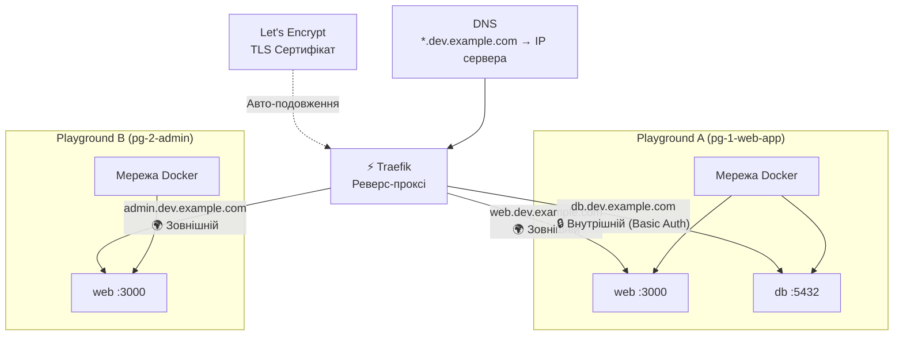

# Мережа

Кожен сервіс у Playground може бути налаштований для мережевого доступу. Платформа автоматично забезпечує маршрутизацію субдоменів, TLS-термінацію та контроль доступу через [Traefik](https://traefik.io/).



## Маршрутизація субдоменів

Кожен відкритий сервіс отримує власний HTTPS-субдомен під кореневим доменом Marquee:

```
https://{subdomain}.{root_domain}
```

Наприклад, якщо кореневий домен вашого Marquee — `dev.example.com`:

| Сервіс | Субдомен | URL |
|--------|----------|-----|
| `web` | `web` | `https://web.dev.example.com` |
| `api` | `api` | `https://api.dev.example.com` |
| `admin` | `admin-panel` | `https://admin-panel.dev.example.com` |

### Маршрутизація головного домену

Використовуйте спеціальний субдомен `@` для маршрутизації **кореневого домену** на сервіс:

| Субдомен | URL |
|----------|-----|
| `@` | `https://dev.example.com` |

### Субдомени за замовчуванням та перевизначення

- **Субдомен за замовчуванням** визначається на [Playspec](/core-concepts/playspec) (зазвичай імʼя сервісу)
- **Перевизначення субдоменів** можна встановити для кожного [Playground](/core-concepts/playground), що критично при запуску кількох Playground на одному Marquee

:::warning Конфлікти субдоменів
Два Playground на одному Marquee не можуть використовувати один субдомен. Завжди перевизначуйте субдомени при запуску кількох Playground з одного Playspec на одному Marquee.
:::

## Видимість: Internal vs External

Кожен відкритий сервіс має налаштування видимості, що контролює доступ:

| Видимість | Контроль доступу | Використовуйте для |
|-----------|-----------------|-------------------|
| **External** | Публічно доступний — автентифікація не потрібна | Користувацькі додатки, API, статичні сайти |
| **Internal** | Захищений HTTP Basic Auth | Адмін-панелі, бази даних, внутрішні інструменти |

### HTTP Basic Auth (внутрішні сервіси)

Внутрішні сервіси захищені HTTP Basic Auth:

| Облікові дані | Значення |
|--------------|---------|
| **Імʼя користувача** | `playground` |
| **Пароль** | Автоматично згенерований для кожного Playground (видимий у детальному перегляді Playground) |

Автентифікація забезпечується middleware `marquee-auth` у Traefik. Облікові дані потрібні тільки при доступі до URL внутрішнього сервісу через браузер — комунікація між сервісами всередині Docker-мережі не зачіпається.

## Внутрішня комунікація (Docker Networking)

Сервіси всередині одного Playground спілкуються через стандартну **мережу Docker Compose**. Використовуйте **імʼя сервісу** як hostname:

```yaml
services:
  web:
    environment:
      DATABASE_URL: postgres://user:pass@db:5432/myapp
      REDIS_URL: redis://redis:6379

  db:
    image: postgres:16

  redis:
    image: redis:7
```

У цьому прикладі сервіс `web` підключається до `db` та `redis` за їхніми іменами у внутрішній мережі Docker. Спеціальна конфігурація не потрібна — платформа створює ізольовану мережу для кожного Playground.

### Мережева ізоляція

Кожен Playground має свою внутрішню Docker-мережу. Сервіси різних Playground **не можуть** спілкуватися між собою, навіть якщо вони працюють на одному Marquee. Всі Playground ділять мережу Traefik Marquee тільки для вхідної маршрутизації.

## Маппінг портів

Порт, вказаний у конфігурації відкриття сервісу, визначає **який порт контейнера** Traefik буде маршрутизувати:

| Поле | Опис |
|------|------|
| **Порт відкриття** | Порт всередині контейнера, що обробляє HTTP-трафік (напр., `3000`, `8080`) |

Платформа налаштовує Traefik для перенаправлення HTTPS (443) трафіку на вказаний порт контейнера. Вам не потрібно обробляти TLS у вашому додатку — Traefik термінує TLS на вході.

### Нестандартний маппінг портів

Для сервісів, яким потрібно відкрити не-HTTP порти (напр., WebSocket-сервери на іншому порті), ви можете визначити маппінг портів у Docker Compose YAML. Ці порти керуються через стандартну публікацію портів Docker Compose.
